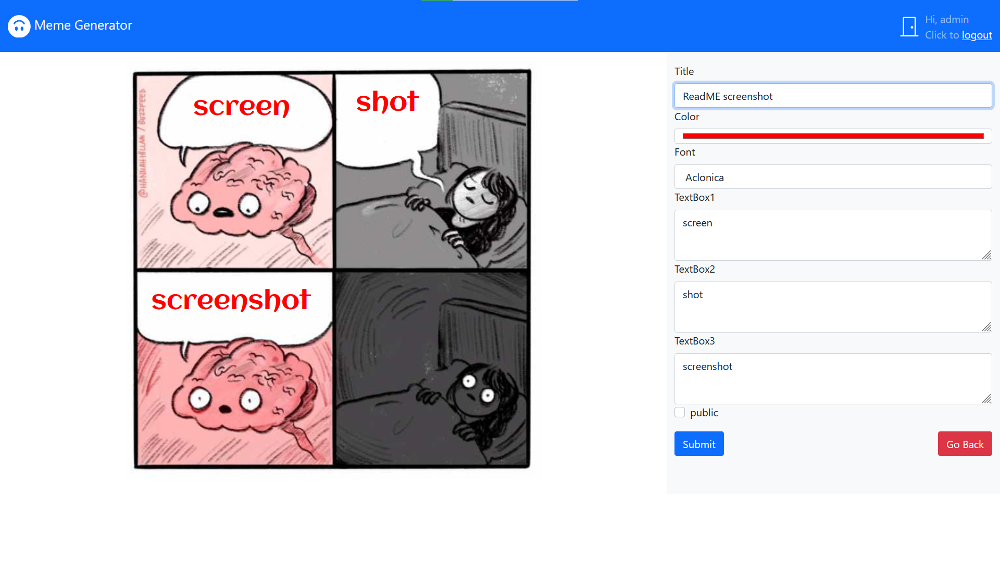

# Exam #2: "Meme Generator"
## Student: s284739 CAPANO FRANCESCO 

## React Client Application Routes

- Route `/`: Home page, shows list of existent memes
- Route `/images`: list of background images for the memes
- Route `/edit/:id`: editor to create a new meme, the id is the id of the image
- Route `/copy/:id`: editor to copy an existing meme, the id is the id of the meme to copy
- Route `/show/:id`: page to show meme details, the id is the id of the meme to show

## API Server

### Get all the memes
- GET `/api/memes`
  - description : get the details of all memes in case of authenticated user, otherwise only public ones
  - request parameters : _none_
  - response body content : array of json objects containing the whole memes database table if the user is logged, otherwise only public memes
  - error responses:  `404 ` not found, `500 ` generic error

### Get meme 
- GET `/api/memes/id`
  - description : get the details of a single meme
  - request parameters : id of the meme to be retrieved
  - response body content : json object containing the row of the memes table wich corresponds to the id requested
  - error responses:  `422 ` error in parameters , `404 ` not found , `500 ` generic error

### Get all images
- GET `/api/images`
  - description : Get all background images informations
  - request parameters : _none_
  - response body content : array of image json objects containing the whole images database table 
  - error responses:  `404 ` not found , `500 ` generic error

### Get background image
- GET `/api/images/id`
  - description : Get informations on a single background image
  - request parameters : id of the image to be retrieved
  - response body content : image json object containing name and positions of textboxes inside the image
  - error responses:  `404 ` not found , `422 ` errors in parameter ,  `500 ` generic error

### Get positions
- GET `/api/positions`
  - description : get all the positions available for the textboxes in memes to be used as styles
  - request parameters : _none_
  - response body content : array of json objects containing the whole positions table of the database in wich there are all the possible positions available for the different backgroung images
  - error responses:  `404 ` not found , `500 ` generic error

### Delete a meme
- DELETE `/api/memes/id`
  - description : delete an existing meme
  - request parameters : id of the meme to be deleted
  - response body content : _none_ or error
  - error responses:  `422 ` errors in parameter , `503` databse error in the delete

### New meme
- POST `/api/memes`
  - description : create a new meme 
  - request parameters: _none_
  - request body content: json meme object wich contains: image for the meme, font, color, positions and relative text, author, title and visibility 
  - response body content: _none_ or json error object in case of error
  - error responses:  `422 ` Error in parameters ,`503 ` database error

### Meme copy
- POST `/api/memes/copy/id`
  - description : create a new meme wich is a copy of an existing 
  - request parameters: id of the meme to be copied
  - request body content: json object wich contains: image for the meme, font, color, positions and relative text, author, title and visibility
  - response body content: _none_ or json error object in case of error
  - error responses:  `422 ` Error in parameters ,`503 ` database error

### Login
- POST `api/sessions`
  - description : user authentication
  - request parameters: _none_
  - request body content: json object with email and password 
  - response body content: user json object (id,name,email)or an error json object in case of error
  - error responses:  `401 ` Not authenticated

### Retrieve logged user
- GET `api/sessions/current`
  - description : retrieve the information related to the logged user
  - request parameters: _none_
  - response body content: user json object (id,name,email)or an error json object in case of error
  - error responses:  `401 ` Not authenticated

### Logout
- DELETE `api/sessions/current`
  - description : logout and delete the current session
  - request parameters: _none_
  - response body content: _none_


#### JSON Data in the API

- Data from server

```JSON
positions : [{ 
  "id" : 1, 
  "style" : { 
  "position" : "relative", 
  "width" : "50%", 
  etc.. }},..., { ... }
  ]

meme : {
  "id":1, 
  "img":"img1.jpg", 
  "title":"title",
  "author":{"id":1,"name":"author"}, 
  "font":"font",
  "color":"#ff0000", 
  "visible":0, 
  "field":[ 
    {"pos": 2,"text":"text1"}, 
    {"pos":5,"text":"text2"}]
    }

image : {
  "id":1, 
  "img":"img1.jpg", 
  "title":"title",
  "fieldNumber":2, 
  "field":[
    {"pos":5},
    {"pos":6}
    ]
  }

user : { 
  "id":1, 
  "username":"admin@polito.it", 
  "name":"admin"
  }

error : {
  "error": "error description"
}

```

-Data to server 
```JSON
user : {  
  "username":"admin@polito.it", 
  "name":"password"
  }

meme : {
  "img":"img1.jpg", 
  "title":"title",
  "author":{"id":1,"name":"author"}, 
  "font":"font",
  "color":"#ff0000", 
  "visible":0, 
  "field":[ 
    {"pos": 2,"text":"text1"}, 
    {"pos":5,"text":"text2"}]
    }

```

## Database Tables

- Table `users` - contains `id`, `email`, name and the `hash` of the password
- Table `memes` - contains `id`, `image` name, `author` (stored as a json object containing id and name), `font` , `color` and `field` (stored as stringyfied array of json objects in wich there is the position, stored as an integer wich reference the id in the positions table, and the relative text)
- Table `images` - contains `id`, `image name`, `number of fields` and `field` for the textboxes with the relative styles ( the position and the relative styles are stored as a stringyfied array of json objects in wich each value corresponds to an id of position)
- Table `positions` - contains `id` and the `style` of the positions for the text boxes (the style is stored as a stringyfied json object)


## Main React Components

- `MyIndex` (in `App.js`): main component, has the switch for the routes and the navbar, manages the more important informations ( user, memes and error management)
- `Editor` (in `Editor.js`): meme editor component, it's possible to edit or copy a meme. You can set text,visibility, font, color and title.
- `Meme` (in `Meme.js`): component to render the meme image with text in the predefined positions and with the chosen font and color
- `MemeShow` (in `MemeShow.js`): component to render the page where the meme ( through the Meme component) is shown along with the title, the author and visibility
- `ImagesGallery` (in `ImagesGallery.js`): component where all the images are displayed and it is possible to choose the background image for a new meme 
- `MemesGallery` (in `MemesGallery.js`): compoment rendered in the home page, which show the list of memes, from here you can show details of the meme and in case you are logged it is possible to copy a meme or delete your own memes
- `LoginForm` (in `LoginForm.js`): component useful for the login where you can insert username and password.
- `MyNavBar` (in `MyNavBar.js`): compoment wich render the navbars for login page and the standard one. Allow the user to be redirect to the home and login page and to log out. It displays also the loading 


(only _main_ components, minor ones may be skipped)

## Screenshot




## Users Credentials

| Username        | Password  | Created memes                          | Copied Memes                          |
| --------------- | --------- | -------------------------------------- |-------------------------------------- |
| admin@polito.it | password  | Me in the shop, Me in the exam session, Alpha boyfriend, Leaving for France, England EURO2020|  CPU in real life(italics)|
| capo@polito.it  | qwerty    | Second call, Quality memes, Goal achieved |Did you fill the ReadMe? (Red), England EURO2020(Update)|
| cosma@polito.it | asdfghjkl |Front end development, CPU in real life, Did yo fill the ReadMe? |England EURO2020|(Boris)